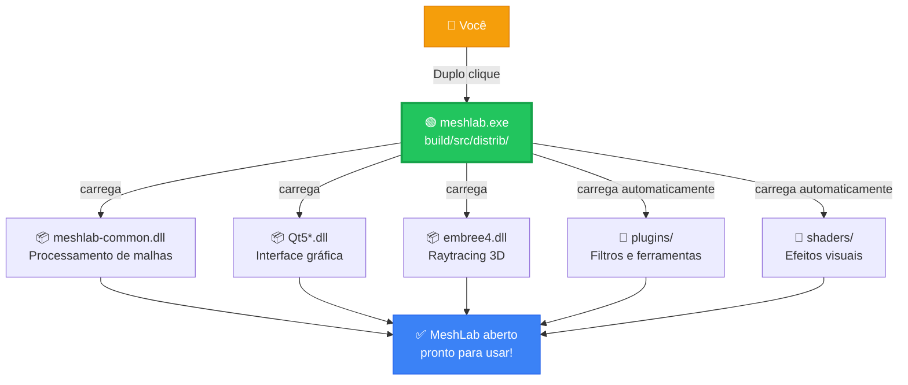

#  MeshLab


[](https://github.com/cnr-isti-vclab/meshlab/actions/workflows/BuildMeshLab.yml)

[](https://doi.org/10.5281/zenodo.5114037)

This is the official repository for the source and the binaries of [MeshLab](https://www.MeshLab.net).

MeshLab is an open source, portable, and extensible system for the processing and editing of unstructured large 3D triangular meshes. It is aimed to help the processing of the typical not-so-small unstructured models arising in 3D scanning, providing a set of tools for editing, cleaning, healing, inspecting, rendering and converting this kind of meshes.

MeshLab is mostly based on the open source C++ mesh processing library [VCGlib](http://www.vcglib.net) developed at the [Visual Computing Lab](http://vcg.isti.cnr.it) of [ISTI - CNR](http://www.isti.cnr.it). VCG can be used as a stand-alone large-scale automated mesh processing pipeline, while MeshLab makes it easy to experiment with its algorithms interactively.

MeshLab is available for Windows, macOS, and Linux.

# Releases

You can find the last MeshLab release in the [Releases Tab](https://github.com/cnr-isti-vclab/meshlab/releases) for your favourite platform.
You can also test the last nightly version of MeshLab, by downloading the artifacts of the last [Github Actions](https://github.com/cnr-isti-vclab/meshlab/actions) workflow. You can find a guide on how to download it [here](https://github.com/cnr-isti-vclab/meshlab/wiki/How-to-install-the-last-nightly-version).

# Build instructions

We provide a set of scripts that build and deploy MeshLab automatically. All the scripts can be found in the [scripts](https://github.com/cnr-isti-vclab/meshlab/tree/main/scripts) folder.
For specific build instructions see the [src](https://github.com/cnr-isti-vclab/meshlab/blob/main/src/README.md) folder.

# Branches and Pull Requests

On this repository, we keep two relevant branches:

- `main`: we keep here the **last release version of MeshLab**, with just bugfixes, optimizations and changes that do not affect the last released MeshLab binary. In case of bugs caught after a release, this branch is used to publish "post-releases".
- `devel`: we add here new features and functionalities of the software that are going to appear in the next release of MeshLab. Bugfixes pushed in `main` are automatically merged into the `devel` branch.

Before committing a new change, or sending a pull request, please choose the branch that better suits for your change. 
If it is just a bugfix, or an edit that does not modify the software (e.g. documentation typos, changes to the deploy system, ...), use the `main` branch. 
If it is a new feature that will change the behaviour or the usage of the software, use the `devel` branch.

# Structure of the Repository

The MeshLab repository is organized as follows:

* `docs`: doxygen scripts for generating MeshLab documentation. For more details, check the readme [here](https://github.com/cnr-isti-vclab/meshlab/tree/master/docs);
* `sample` and `textures`: a set of files (meshes, images) used for tests;
* `resources`: contains a set of files used by the software and by the deploy system to produce the final MeshLab binary;
* `scripts`: in this folder there is a set of platform-dependent scripts to build and deploy MeshLab. For more details, check the readme [here](https://github.com/cnr-isti-vclab/meshlab/tree/master/scripts/README.md);
* `src`: this folder contains all the source code of MeshLab and its plugins. For more details, check the readme [here](https://github.com/cnr-isti-vclab/meshlab/blob/master/src/README.md);
* `unsupported`: this folder contains a set of old and unsupported MeshLab plugins that are no longer included and built under MeshLab.
# 🗂️ MeshLab — Estrutura de Pastas e Como Executar

## ▶️ Como Rodar o Programa

> [!IMPORTANT]
> O único arquivo que você precisa clicar para abrir o MeshLab é:
>
> **`build\src\distrib\`** → **`meshlab.exe`** ← duplo clique aqui!

Todos os outros arquivos da pasta `distrib\` são dependências que ficam **ao lado** do `.exe` e são carregados automaticamente. Você **não precisa tocar em nenhum outro arquivo**.

---

## 📁 Visão Geral do Projeto (raiz)

```
MeshLab-Main\                        ← Raiz do projeto
│
├── 📄 README_PT.md                  ← Descrição do projeto em Português
├── 📄 README.md                     ← Descrição original em Inglês
├── 📄 CMakeLists.txt                ← Receita de compilação (CMake)
├── 📄 build_temp.bat                ← Script para recompilar no Windows
├── 📄 LICENSE.txt                   ← Licença GPL do software
├── 📄 ML_VERSION                    ← Número da versão atual
│
├── 📂 build\                        ← Resultado da compilação
│   └── 📂 src\
│       └── 📂 distrib\              ← ✅ PASTA DO EXECUTÁVEL PRONTO
│
├── 📂 src\                          ← Código-fonte do programa
├── 📂 resources\                    ← Ícones e recursos visuais
├── 📂 scripts\                      ← Scripts de build (Linux/Mac/Win)
├── 📂 docs\                         ← Documentação técnica
├── 📂 sample\                       ← Arquivos 3D de exemplo
├── 📂 textures\                     ← Texturas de exemplo
└── 📂 unsupported\                  ← Plugins antigos (não usados)
```

---

## ✅ Pasta do Executável — `build\src\distrib\`

Esta é a única pasta que importa para **rodar o programa**. Tudo que o MeshLab precisa está aqui:

```
distrib\
│
├── 🟢 meshlab.exe              ← ▶️ ARQUIVO PRINCIPAL — execute este!
├──    UseCPUOpenGL.exe         ← Alternativa se der problema gráfico
│
├── ── Bibliotecas do Qt (Interface Gráfica) ──
├── 📦 Qt5Core.dll              ← Núcleo do Qt
├── 📦 Qt5Gui.dll               ← Janelas e gráficos
├── 📦 Qt5Widgets.dll           ← Botões, menus, painéis
├── 📦 Qt5OpenGL.dll            ← Renderização 3D via OpenGL
├── 📦 Qt5Network.dll           ← Rede (online check)
├── 📦 Qt5Svg.dll               ← Ícones SVG
├── 📦 Qt5Xml.dll               ← Leitura de XML
│
├── ── Bibliotecas do MeshLab ──
├── 📦 meshlab-common.dll       ← Core do MeshLab (processamento)
├── 📦 meshlab-common-gui.dll   ← Interface do MeshLab
│
├── ── Bibliotecas 3D / Motores ──
├── 📦 embree4.dll              ← Motor de raytracing (Intel Embree)
├── 📦 external-glew.dll        ← Extensões OpenGL
├── 📦 external-lib3ds.dll      ← Suporte ao formato 3DS
├── 📦 lib3mf.dll               ← Suporte ao formato 3MF
├── 📦 E57Format.dll            ← Suporte a nuvem de pontos E57
├── 📦 tbb12.dll                ← Paralelismo multi-thread (Intel TBB)
│
├── ── Bibliotecas Matemáticas ──
├── 📦 muparser.dll             ← Parser de expressóes matemáticas
├── 📦 libgmp-10.dll            ← Aritmética de precisão arbitrária
├── 📦 libmpfr-4.dll            ← Aritmética de ponto flutuante precisa
│
├── ── Bibliotecas OpenGL / Diagnóstico ──
├── 📦 IFXCore.dll              ← Suporte U3D/IFX
├── 📦 IFXExporting.dll         ← Exportação U3D
├── 📦 IFXScheduling.dll        ← Agendamento U3D
├── 📦 libEGL.dll               ← Interface OpenGL ES
├── 📦 libGLESv2.dll            ← OpenGL ES 2.0
├── 📦 opengl32sw.dll           ← OpenGL por software (fallback)
├── 📦 D3Dcompiler_47.dll       ← Compilador shader DirectX
├── 📦 xerces-c_3_2.dll         ← Parser XML pesado (formatos 3D)
│
├── 📂 plugins\                 ← Filtros e ferramentas extras
│   ├── 📦 filter_meshing.dll   ← Decimação, suavização
│   ├── 📦 filter_color.dll     ← Filtros de cor/textura
│   ├── 📦 io_base.dll          ← Importar/exportar OBJ, PLY, STL...
│   └── 📦 ... (mais ~30 plugins)
│
├── 📂 shaders\                 ← Efeitos visuais (GLSL)
│   ├── 📄 toon.frag/.vert      ← Estilo cartoon
│   ├── 📄 phong.frag/.vert     ← Iluminação Phong
│   ├── 📄 xray.frag/.vert      ← Efeito raio-X
│   └── 📂 decorate_shadow\    ← Sombras e SSAO
│
├── 📂 platforms\               ← Integração com Windows
│   └── 📦 qwindows.dll
│
├── 📂 imageformats\            ← Suporte a formatos de imagem
│   ├── 📦 qjpeg.dll, qpng...
│   └── (JPG, PNG, SVG, TIFF, WebP...)
│
├── 📂 iconengines\             ← renderização de ícones SVG
├── 📂 bearer\                  ← gestão de rede Qt
├── 📂 styles\                  ← Tema visual do Windows
└── 📂 translations\            ← Traduções Qt (pt, en, es, fr...)
```

---

## 🔗 Fluxo de execução simplificado



---

## 📌 Resumo Rápido

| O que fazer | Onde |
|-------------|------|
| ▶️ **Abrir o MeshLab** | `build\src\distrib\meshlab.exe` |
| 🔧 **Recompilar** | Rodar `build_temp.bat` na raiz |
| 📖 **Documentação PT** | `README_PT.md` na raiz |
| 🔌 **Adicionar plugins** | `build\src\distrib\plugins\` |
| 🎨 **Shaders / Efeitos** | `build\src\distrib\shaders\` |
| 💻 **Código-fonte** | `src\meshlab\` e `src\meshlabplugins\` |


# License

 The Meshlab source is released under the [GPL License](LICENSE.txt).

# Copyright

```
   MeshLab
   https://www.meshlab.net
   All rights reserved.

   VCGLib  http://www.vcglib.net                                     o o
   Visual and Computer Graphics Library                            o     o
                                                                  _   O  _
   Paolo Cignoni                                                    \/)\/
   Visual Computing Lab  http://vcg.isti.cnr.it                    /\/|
   ISTI - Italian National Research Council                           |
   Copyright(C) 2005-2021                                             \
```

# References

[](https://doi.org/10.5281/zenodo.5114037)


Please, when using this tool, cite the references listed in the official web page https://www.meshlab.net/#references according to you needs, or if you are lazy just cite:

```
@software{meshlab,
  author       = {Cignoni, Paolo and Muntoni, Alessandro and Ranzuglia, Guido and Callieri, Marco},
  title        = {MeshLab},
  publisher    = {Zenodo},
  doi          = {10.5281/zenodo.5114037}
}

@inproceedings {LocalChapterEvents:ItalChap:ItalianChapConf2008:129-136,
  booktitle = {Eurographics Italian Chapter Conference},
  editor    = {Vittorio Scarano and Rosario De Chiara and Ugo Erra},
  title     = {{MeshLab: an Open-Source Mesh Processing Tool}},
  author    = {Cignoni, Paolo and Callieri, Marco and Corsini, Massimiliano and Dellepiane, Matteo and Ganovelli, Fabio and Ranzuglia, Guido},
  year      = {2008},
  publisher = {The Eurographics Association},
  ISBN      = {978-3-905673-68-5},
  DOI       = {10.2312/LocalChapterEvents/ItalChap/ItalianChapConf2008/129-136}
}
```

# Contacts

 - Paolo Cignoni (paolo.cignoni (at) isti.cnr.it)
 - Alessandro Muntoni (alessandro.muntoni (at) isti.cnr.it)

# Feedback

For documented and repeatable bugs, feature requests, etc., please use the [GitHub issues](https://github.com/cnr-isti-vclab/meshlab/issues).

For general questions use [StackOverflow](http://stackoverflow.com/questions/tagged/meshlab).
