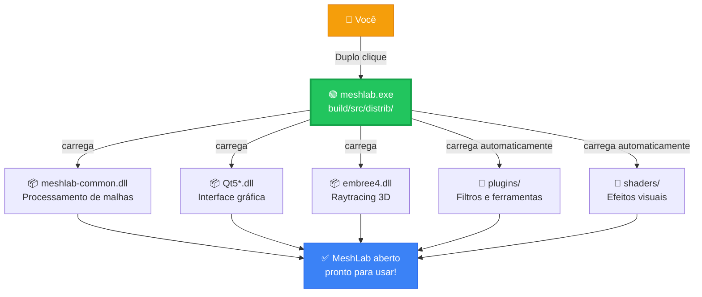

# MeshLab — Documentação em Português

## O que é o MeshLab?

O **MeshLab** é um software de código aberto para **processamento, edição e análise de malhas 3D triangulares**. Ele foi desenvolvido para facilitar o trabalho com modelos 3D grandes e complexos, do tipo gerado por scanners 3D, fotogrametria e outras técnicas de captura de geometria.

Com o MeshLab você pode:

- 🧹 **Limpar e reparar malhas**: remover duplicatas, preencher buracos, corrigir normais invertidas
- 🔬 **Inspecionar geometria**: medir distâncias, ângulos, volumes, curvatura
- ✂️ **Editar e simplificar**: decimação de polígonos, suavização, corte, fusão de meshes
- 🎨 **Renderizar e visualizar**: modo wireframe, texturas, mapas de normais, iluminação personalizada
- 🔄 **Converter formatos**: importa/exporta OBJ, PLY, STL, FBX, E57, GLTF, e muitos outros
- 📐 **Reconstrução de superfície**: geração de malhas a partir de nuvens de pontos
- 🔎 **Ferramentas científicas**: alinhamento de scans (ICP), análise de qualidade, filtragem avançada

É amplamente usado em **arqueologia, medicina, engenharia reversa, animação 3D e pesquisa acadêmica**.

---

## ▶️ Como Rodar o Programa (Sem compilar)

> [!IMPORTANT]
> O único arquivo que você precisa clicar para abrir o MeshLab é:
>
> **`build\src\distrib\`** → **`meshlab.exe`** ← duplo clique aqui!

Todos os outros arquivos da pasta `distrib\` são dependências que ficam **ao lado** do `.exe` e são carregados automaticamente. Você **não precisa tocar em nenhum outro arquivo**.

---

## 📁 Estrutura do Projeto (Visão Geral)

```
MeshLab-Main\                        ← Raiz do projeto
│
├── 📄 README_PT.md                  ← Descrição do projeto em Português
├── 📄 README.md                     ← Descrição original em Inglês
├── 📄 CMakeLists.txt                ← Receita de compilação (CMake)
├── 📄 build_temp.bat                ← Script para recompilar no Windows
├── 📄 LICENSE.txt                   ← Licença GPL do software
├── 📄 ML_VERSION                    ← Número da versão atual
│
├── 📂 build\                        ← Resultado da compilação
│   └── 📂 src\
│       └── 📂 distrib\              ← ✅ PASTA DO EXECUTÁVEL PRONTO
│
├── 📂 src\                          ← Código-fonte do programa
├── 📂 resources\                    ← Ícones e recursos visuais
├── 📂 scripts\                      ← Scripts de build (Linux/Mac/Win)
├── 📂 docs\                         ← Documentação técnica
├── 📂 sample\                       ← Arquivos 3D de exemplo
├── 📂 textures\                     ← Texturas de exemplo
└── 📂 unsupported\                  ← Plugins antigos (não usados)
```

---

## ✅ Detalhes da Pasta do Executável — `build\src\distrib\`

Esta é a única pasta que importa para **rodar o programa**. Tudo que o MeshLab precisa está aqui:

| Arquivo/Pasta | Descrição |
|---------------|-----------|
| 🟢 **meshlab.exe** | ▶️ **ARQUIVO PRINCIPAL** — execute este! |
| `UseCPUOpenGL.exe` | Alternativa se houver problema gráfico |
| `plugins/` | Filtros e ferramentas extras (carregados automaticamente) |
| `shaders/` | Efeitos visuais (Phong, Toon, X-Ray, Sombras...) |
| `imageformats/` | Suporte a JPG, PNG, WebP, etc. |
| `Qt5*.dll` | Interface gráfica (Qt 5.15.2) |
| `embree4.dll` | Motor de raytracing de alta performance |
| `meshlab-common.dll` | Core de processamento de malhas |

---

## 🔗 Fluxo de Execução Simplificado



---

## 🛠️ Como (re)compilar do zero

Caso precise recompilar, você precisará de:

- **Visual Studio 2019 Build Tools** (MSVC x64)
- **Qt 5.15.2** instalado em `C:\Qt\5.15.2\msvc2019_64`
- **CMake** em `C:\Program Files\CMake`
- **Ninja** (via Chocolatey: `choco install ninja`)

Execute o script:

```bat
build_temp.bat
```

Ou manualmente na pasta `build/`:

```bat
cmake -GNinja -DCMAKE_BUILD_TYPE=Release -DCMAKE_PREFIX_PATH="C:\Qt\5.15.2\msvc2019_64" ..
ninja
```

---

## 📌 Resumo Rápido

| O que fazer | Onde |
|-------------|------|
| ▶️ **Abrir o MeshLab** | `build\src\distrib\meshlab.exe` |
| 🔧 **Recompilar** | Rodar `build_temp.bat` na raiz |
| 📖 **Documentação PT** | `README_PT.md` na raiz |
| 🔌 **Adicionar plugins** | `build\src\distrib\plugins\` |
| 🎨 **Shaders / Efeitos** | `build\src\distrib\shaders\` |

---

## 🔗 Links úteis

- Site oficial: https://www.meshlab.net
- Repositório original: https://github.com/cnr-isti-vclab/meshlab
- Licença: GPL (veja `LICENSE.txt`)

---

## 👤 Sobre esta versão

Esta é uma **versão local personalizada** do MeshLab, compilada e mantida para uso direto no Windows sem necessidade de instalação. O executável está incluído no repositório para facilitar a distribuição e evitar o processo de compilação.
