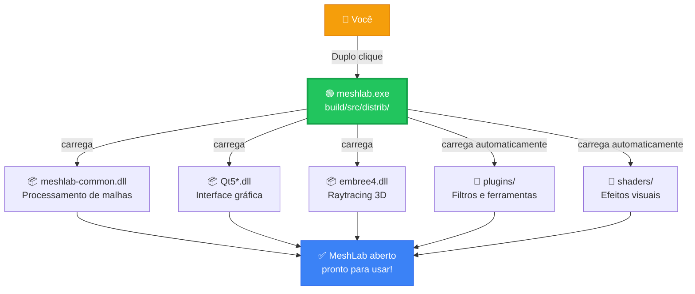

# MeshLab — Documentação em Português

## O que é o MeshLab?

O **MeshLab** é um software de código aberto para **processamento, edição e análise de malhas 3D triangulares**. Ele foi desenvolvido para facilitar o trabalho com modelos 3D grandes e complexos, do tipo gerado por scanners 3D, fotogrametria e outras técnicas de captura de geometria.

Com o MeshLab você pode:

- 🧹 **Limpar e reparar malhas**: remover duplicatas, preencher buracos, corrigir normais invertidas
- 🔬 **Inspecionar geometria**: medir distâncias, ângulos, volumes, curvatura
- ✂️ **Editar e simplificar**: decimação de polígonos, suavização, corte, fusão de meshes
- 🎨 **Renderizar e visualizar**: modo wireframe, texturas, mapas de normais, iluminação personalizada
- 🔄 **Converter formatos**: importa/exporta OBJ, PLY, STL, FBX, E57, GLTF, e muitos outros
- 📐 **Reconstrução de superfície**: geração de malhas a partir de nuvens de pontos
- 🔎 **Ferramentas científicas**: alinhamento de scans (ICP), análise de qualidade, filtragem avançada

É amplamente usado em **arqueologia, medicina, engenharia reversa, animação 3D e pesquisa acadêmica**.

---

## ▶️ Como Executar o Programa

> **O único arquivo que você precisa clicar é:**
>
> `build\src\distrib\` → **`meshlab.exe`** ← duplo clique aqui!

Todos os outros arquivos da pasta `distrib\` são dependências carregadas **automaticamente**. Você não precisa tocar em nenhum outro arquivo.

---

## 🔗 Fluxo de Execução



---

## 📁 Estrutura de Pastas do Projeto (raiz)

```
MeshLab-Main\                        ← Raiz do projeto
│
├── 📄 README_PT.md                  ← Descrição do projeto em Português
├── 📄 README.md                     ← Descrição original em Inglês
├── 📄 CMakeLists.txt                ← Receita de compilação (CMake)
├── 📄 build_temp.bat                ← Script para recompilar no Windows
├── 📄 LICENSE.txt                   ← Licença GPL do software
├── 📄 ML_VERSION                    ← Número da versão atual
│
├── 📂 build\                        ← Resultado da compilação
│   └── 📂 src\
│       └── 📂 distrib\              ← ✅ PASTA DO EXECUTÁVEL PRONTO
│
├── 📂 src\                          ← Código-fonte do programa
├── 📂 resources\                    ← Ícones e recursos visuais
├── 📂 scripts\                      ← Scripts de build (Linux/Mac/Win)
├── 📂 docs\                         ← Documentação técnica
├── 📂 sample\                       ← Arquivos 3D de exemplo
├── 📂 textures\                     ← Texturas de exemplo
└── 📂 unsupported\                  ← Plugins antigos (não usados)
```

---

## ✅ Pasta do Executável — `build\src\distrib\`

Esta é a única pasta que importa para rodar o programa. Tudo que o MeshLab precisa está aqui:

```
distrib\
│
├── 🟢 meshlab.exe              ← ▶️ ARQUIVO PRINCIPAL — execute este!
├──    UseCPUOpenGL.exe         ← Alternativa se der problema gráfico
│
├── ── Bibliotecas do Qt (Interface Gráfica) ──
├── 📦 Qt5Core.dll              ← Núcleo do Qt
├── 📦 Qt5Gui.dll               ← Janelas e gráficos
├── 📦 Qt5Widgets.dll           ← Botões, menus, painéis
├── 📦 Qt5OpenGL.dll            ← Renderização 3D via OpenGL
├── 📦 Qt5Network.dll           ← Rede (online check)
├── 📦 Qt5Svg.dll               ← Ícones SVG
├── 📦 Qt5Xml.dll               ← Leitura de XML
│
├── ── Bibliotecas do MeshLab ──
├── 📦 meshlab-common.dll       ← Core do MeshLab (processamento)
├── 📦 meshlab-common-gui.dll   ← Interface do MeshLab
│
├── ── Bibliotecas 3D / Motores ──
├── 📦 embree4.dll              ← Motor de raytracing (Intel Embree)
├── 📦 external-glew.dll        ← Extensões OpenGL
├── 📦 external-lib3ds.dll      ← Suporte ao formato 3DS
├── 📦 lib3mf.dll               ← Suporte ao formato 3MF
├── 📦 E57Format.dll            ← Suporte a nuvem de pontos E57
├── 📦 tbb12.dll                ← Paralelismo multi-thread (Intel TBB)
│
├── ── Bibliotecas Matemáticas ──
├── 📦 muparser.dll             ← Parser de expressões matemáticas
├── 📦 libgmp-10.dll            ← Aritmética de precisão arbitrária
├── 📦 libmpfr-4.dll            ← Aritmética de ponto flutuante precisa
│
├── ── Bibliotecas OpenGL / Diagnóstico ──
├── 📦 IFXCore.dll              ← Suporte U3D/IFX
├── 📦 IFXExporting.dll         ← Exportação U3D
├── 📦 IFXScheduling.dll        ← Agendamento U3D
├── 📦 libEGL.dll               ← Interface OpenGL ES
├── 📦 libGLESv2.dll            ← OpenGL ES 2.0
├── 📦 opengl32sw.dll           ← OpenGL por software (fallback)
├── 📦 D3Dcompiler_47.dll       ← Compilador shader DirectX
├── 📦 xerces-c_3_2.dll         ← Parser XML pesado (formatos 3D)
│
├── 📂 plugins\                 ← Filtros e ferramentas extras
│   ├── 📦 filter_meshing.dll   ← Decimação, suavização
│   ├── 📦 filter_color.dll     ← Filtros de cor/textura
│   ├── 📦 io_base.dll          ← Importar/exportar OBJ, PLY, STL...
│   └── 📦 ... (mais ~30 plugins)
│
├── 📂 shaders\                 ← Efeitos visuais (GLSL)
│   ├── 📄 toon.frag/.vert      ← Estilo cartoon
│   ├── 📄 phong.frag/.vert     ← Iluminação Phong
│   ├── 📄 xray.frag/.vert      ← Efeito raio-X
│   └── 📂 decorate_shadow\     ← Sombras e SSAO
│
├── 📂 platforms\               ← Integração com Windows
│   └── 📦 qwindows.dll
│
├── 📂 imageformats\            ← Suporte a formatos de imagem
│   └── (JPG, PNG, SVG, TIFF, WebP...)
│
├── 📂 styles\                  ← Tema visual do Windows
└── 📂 translations\            ← Traduções Qt (pt, en, es, fr...)
```

---

## 📌 Resumo Rápido

| O que fazer | Onde |
|-------------|------|
| ▶️ **Abrir o MeshLab** | `build\src\distrib\meshlab.exe` |
| 🔧 **Recompilar** | Rodar `build_temp.bat` na raiz |
| 📖 **Documentação PT** | `README_PT.md` na raiz |
| 🔌 **Adicionar plugins** | `build\src\distrib\plugins\` |
| 🎨 **Shaders / Efeitos** | `build\src\distrib\shaders\` |
| 💻 **Código-fonte** | `src\meshlab\` e `src\meshlabplugins\` |

---

## 🛠️ Como (Re)compilar do Zero

Caso precise recompilar, você precisará de:

- **Visual Studio 2019 Build Tools** (MSVC x64)
- **Qt 5.15.2** instalado em `C:\Qt\5.15.2\msvc2019_64`
- **CMake** em `C:\Program Files\CMake`
- **Ninja** (via Chocolatey: `choco install ninja`)

Execute o script:

```bat
build_temp.bat
```

Ou manualmente na pasta `build/`:

```bat
cmake -GNinja -DCMAKE_BUILD_TYPE=Release -DCMAKE_PREFIX_PATH="C:\Qt\5.15.2\msvc2019_64" ..
ninja
```

---

## 🔗 Links Úteis

- Site oficial: https://www.meshlab.net
- Repositório original: https://github.com/cnr-isti-vclab/meshlab
- Licença: GPL (veja `LICENSE.txt`)

---

## 👤 Sobre Esta Versão

Esta é uma **versão local personalizada** do MeshLab, compilada e mantida para uso direto no Windows sem necessidade de instalação. O executável está incluído no repositório para facilitar a distribuição e evitar o processo de compilação.
